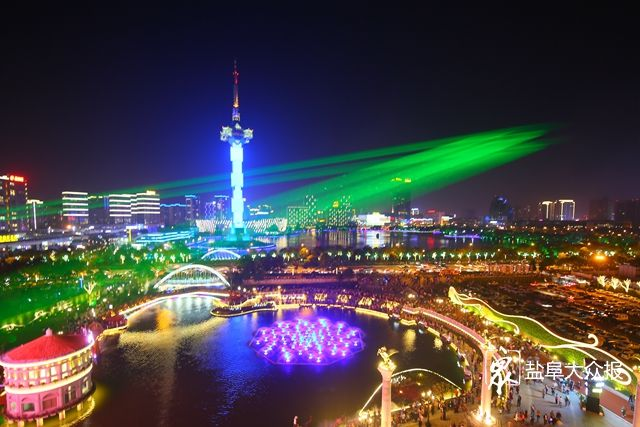
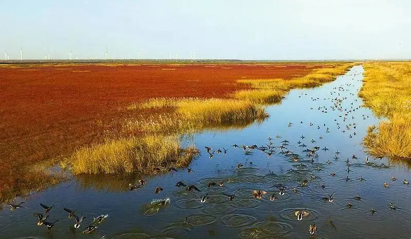
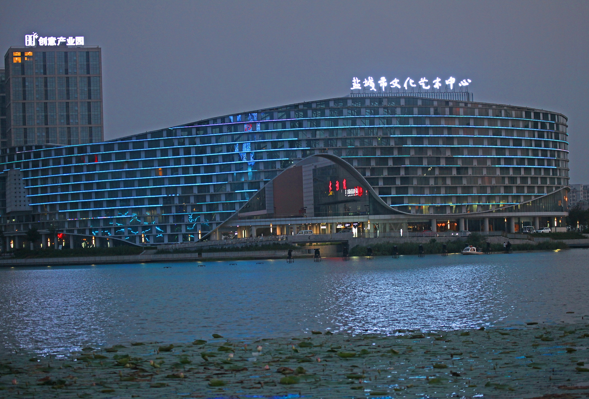

<html>
<head>
<meta charset="utf-8">
<link href="css/all.css" rel="stylesheet"  media="all" type="text/css" />
<title>盐城</title>
</head>

<body>

  

    

  

  

    <ul class="center">
      <li><a href="home.html">网站首页</a></li>
      <li><a href="introduction.html">关于盐城</a></li>
      <li><a href="jiaxiangfengmao.html">家乡风貌</a></li>
      <li><a href="lishiwenhua.html">历史文化</a></li>
      <li><a href="jiaxiangmeishi.html">家乡美食</a></li> 
      <li><a href="shequluntan.html">社区论坛</a></li>
      
     
    </ul>
  

   

    

      

        

          <ul>
            <li style="display:block">  </li>
            <li style="display:none">  </li>
            <li style="display:none">  </li>
          </ul>
        

        <a href="javascript:;" class="focus_l" id="focus_l" title="上一张"><b></b></a> <a href="javascript:;" class="focus_r" id="focus_r" title="下一张"><b></b></a> 

    

  

  
  

  

      <h3>风景秀丽</h3>
    

    

      <ul>
        <li> </li>
        <li>  </li>
        <li>  </li>
        <li> </li>
        <li> </li>
        <li> </li>
        <li> </li>
		<li> </li>

      </ul>
    

	  

      <h3>盐城简介</h3>
    

    
      
盐城市，江苏省辖地级市，Ⅱ型大城市  ，长江三角洲中心区城市。盐城市，江苏省辖地级市，Ⅱ型大城市   ，长江三角洲中心区城市，  地处中国东部沿海地区，江苏东部，东临黄海，南与南通接壤，西南与扬州、泰州为邻，西北与淮安相连，北隔灌河和连云港相望。
        盐城全市土地总面积16931平方千米，其中沿海滩涂面积4553平方千米。拥有江苏唯一的世界自然遗产中国黄（渤）海候鸟栖息地。2022年末，盐城市常住人口668.97万人，常住人口城镇化率65.43%。 

        盐城海陆空交通便捷，基本形成高速公路、铁路、航空、海运、内河航运五位一体的立体化交通运输网络。南洋国际机场、盐城港大丰港区、滨海港区、射阳港区、响水港区成为国家一类开放口岸 ，盐城市成为同时拥有空港、海港两个一类开放口岸的地级市， 是国家沿海发展和长三角一体化两大战略的交汇点。 
        2022年，盐城市地区生产总值达7079.8亿元，按可比价格计算，比上年增长4.6%，三次产业增加值比例为11.2:41.4:47.4。人均地区生产总值达105647元。

   

    

    

      <ul>
        <li> </li>
        <li>  </li>
        <li>  </li>
        <li> </li>
        <li> </li>
        <li> </li>
        <li> </li>
		<li> </li>

      </ul>
    

    

  

  <h1>海内存知己，天涯若比邻 </h1>

</body>
</html>

@charset "utf-8";
/* CSS Document */

